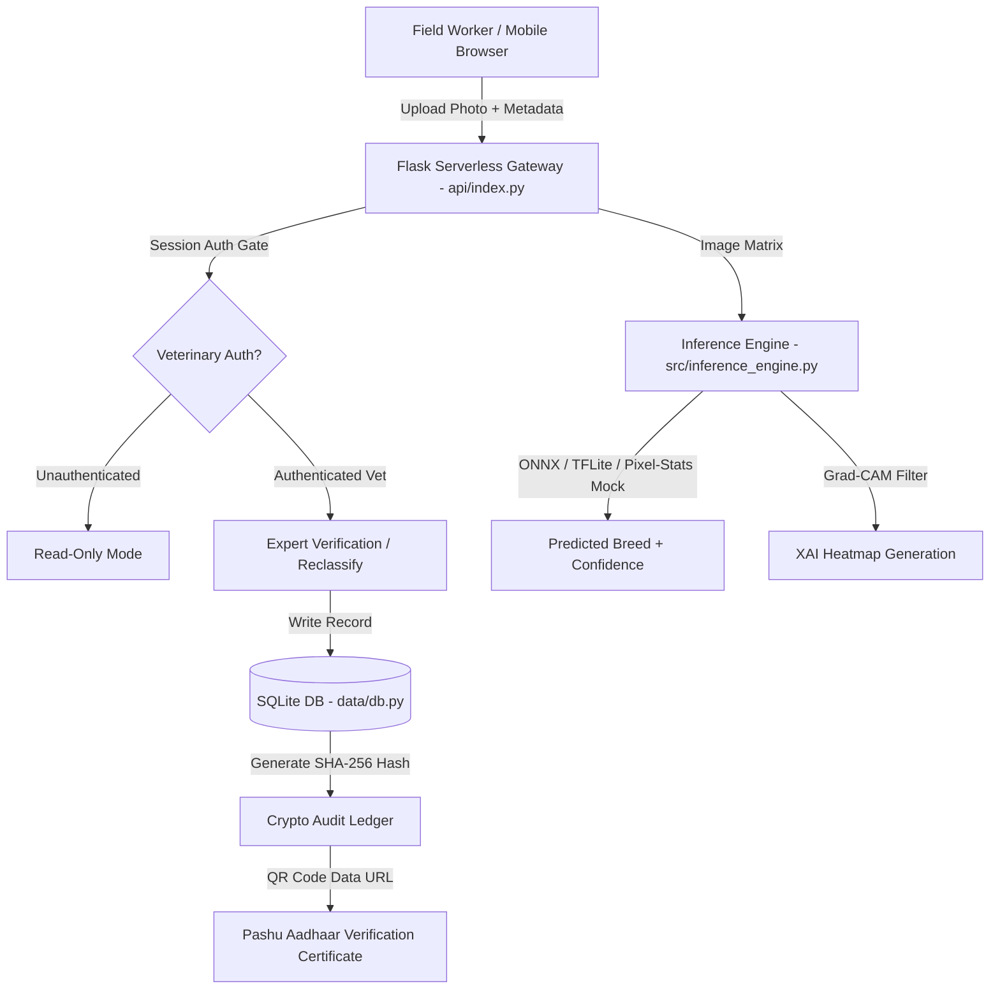

# 🐄 Bharat Pashu-Pehchaan (भारत पशु-पहचान)
### Digital Livestock Intelligence & Breed Verification Platform

[](https://www.python.org/)
[](https://flask.palletsprojects.org/)
[](LICENSE)
[](https://vercel.com/)

---

## 📌 Problem Overview

India is home to **43 recognized indigenous cattle breeds** and **13 buffalo breeds** — the highest livestock genetic diversity of any nation in the world. Indigenous Zebu cattle (*Bos indicus*) and riverine buffaloes possess unique genetic traits such as extreme heat tolerance, tick/parasite resistance, and high-fat A2 milk production.

However, in rural field registrations, **breed misidentification rates exceed 30%** due to visual similarity among local breeds, lack of field worker training, and paper-based data entry. Misregistration leads to:
1. Incorrect subsidy and insurance allocation.
2. Ineffective crossbreeding programs that dilute indigenous genetic purity.
3. Lack of verifiable, tamper-evident audit trails for government livestock registries.

**Bharat Pashu-Pehchaan** solves this by providing an offline-capable, AI-powered breed identification platform with Explainable AI (XAI) feature heatmaps, veterinary expert verification workflows, and SHA-256 cryptographic audit logging.

---

## 🎯 Current Implementation Status & Production Notes

> [!IMPORTANT]
> **Honest Implementation Status**:
> - **Inference Engine**: The codebase includes full inference logic (`src/inference_engine.py`) designed to run ONNX or INT8 Quantized TFLite models. Heavy binary weight files (`.onnx`, `.tflite`) are excluded from git tracking to respect repository size limits. In the serverless production deployment (Vercel), the engine operates in **`_MockBackend` mode**, calculating deterministic predictions and confidence variance from image pixel statistics.
> - **Backend & Auth**: The Flask API (`api/index.py`), SQLite persistence (`data/db.py`), Session-based Veterinary Expert Authentication (`/api/login`), and SHA-256 Cryptographic Audit Ledger are **100% functional and live**.
> - **Mobile App**: The `android/` directory contains Android Studio Gradle scaffolding. The web application (`index.html`) is mobile-responsive and includes offline PWA IndexedDB caching.

---

## ✨ Key Features

1. **🔬 AI Breed Studio & Explainable AI (XAI)**
   - Upload or capture cattle/buffalo photos.
   - Generates morphological feature heatmaps (dewlap, hump, horns, forehead attention areas) to explain the classification visually.
   - Accepts region and coat color metadata to perform multimodal heuristics.

2. **👩‍⚕️ Session-Based Veterinary Expert Verification**
   - Authentication gate (`/api/login`) protecting verification endpoints (`/api/verify`, `/api/retrain`).
   - Hardcoded demo vet officer accounts (e.g., `dr_sharma` / `vet123` - Dr. Rajesh Sharma, License #VET-GJ-2018-842).
   - Prevents unauthorized visitors from modifying expert audit records.

3. **🔐 SHA-256 Cryptographic Audit Ledger**
   - Every verification generates an immutable SHA-256 hash (`hashlib.sha256(scan_id + breed + verifier + timestamp)`).
   - Generates Base64 QR code verification badges linking scan UID (`PA-XXXXXXXX`) to official records.

4. **📚 60-Breed Encyclopedia**
   - Detailed profiles for 60 recognized Indian zebu cattle and buffalo breeds (Gir, Sahiwal, Kankrej, Murrah, Red Sindhi, Punganur, Kasaragod Dwarf, etc.).
   - Includes milk yield, native tract, specialities, disease resistance, and optimal crossbreeding recommendations.

5. **📱 Offline-First IndexedDB Caching**
   - Field workers can save scans locally on-device without internet connectivity.
   - On-demand cloud synchronization button (`syncLocalScansToBackend()`) uploads pending scans when connection is restored.

---

## 🏗️ Tech Stack & System Architecture



- **Frontend**: HTML5, Modern CSS Grid/Flexbox, JavaScript (ES6+), IndexedDB API, Web Speech API.
- **Backend**: Python 3.9+, Flask, Flask Sessions, SQLite3 (`data/db.py`), Base64/Pillow Image processing, `qrcode` library.
- **Inference Pipeline**: PyTorch / MobileNetV2 / EfficientNet training scripts, ONNX Runtime / TFLite Runtime wrappers (`src/inference_engine.py`).
- **Deployment**: Vercel Serverless Python Runtime (`vercel.json`).

---

## 📂 Clean Repository Structure

```
.
├── api/                        # Vercel serverless Flask entry point (index.py)
├── expert-dashboard/           # Flask web application
│   ├── static/                 # CSS stylesheets, JS scripts, static photography
│   └── templates/              # Single-page HTML template (index.html)
├── data/                       # SQLite database handler (db.py) & schema initialization
├── src/                        # Core AI inference & XAI engine (inference_engine.py)
├── models/                     # Breed class mapping definitions (breed_mapping.json)
├── scripts/                    # Categorized development and research scripts
│   ├── data_prep/              # Dataset creation, splitting, cleaning & folder structure
│   ├── analysis/               # Dataset quality reports, breed stats & JSON metrics
│   ├── training/               # Model training scripts (MobileNetV2, EfficientNet)
│   └── evaluation/             # Model evaluation & build verification scripts
├── tests/                      # Pytest suite (test_pipeline.py, test_app.py)
├── notebooks/                  # Jupyter notebooks for exploratory data analysis
├── android/                    # Android Studio PWA/native project scaffolding
├── docs/                       # Screenshots and architectural reports
│   └── screenshots/            # UI screenshots & pipeline diagrams
├── requirements.txt            # Python dependencies
├── vercel.json                 # Vercel deployment configuration
├── LICENSE                     # MIT License
├── run_dashboard.bat           # Local Windows launch script
└── run_dashboard.sh            # Local Linux/macOS launch script
```

---

## 🚀 Quickstart & Local Setup

### Prerequisites
- Python 3.9 or higher installed.
- Git.

### 1. Clone the Repository
```bash
git clone https://github.com/Aadityavariar/breed-recognition.git
cd breed-recognition
```

### 2. Set Up Virtual Environment & Install Dependencies
```bash
# Windows
python -m venv venv
venv\Scripts\activate

# Linux / macOS
python3 -m venv venv
source venv/bin/activate

# Install dependencies
pip install -r requirements.txt
```

### 3. Run Locally

**Option A: Using Launch Scripts**
- **Windows**: Double-click `run_dashboard.bat` or execute `.\run_dashboard.bat`
- **Linux/macOS**: Execute `bash run_dashboard.sh`

**Option B: Direct Flask Execution**
```bash
python expert-dashboard/app.py
```
Open your browser and navigate to: `http://127.0.0.1:5000`

---

## 🧪 Running Automated Tests

Run the full pytest suite to verify inference pipeline mechanics, confidence score variance, and API endpoints:

```bash
pytest tests/ -v
```

---

## 🔑 Demo Expert Credentials

To test the Expert Queue verification and reclassification workflow, use the quick login buttons or enter these credentials in the login modal:

| Username | Password | Officer Name | License ID | Role |
| :--- | :--- | :--- | :--- | :--- |
| `dr_sharma` | `vet123` | Dr. Rajesh Sharma | `VET-GJ-2018-842` | Senior Veterinary Officer (Gujarat) |
| `dr_patel` | `vet123` | Dr. Ananya Patel | `VET-MH-2020-119` | Livestock Development Officer |
| `dr_singh` | `vet123` | Dr. Vikram Singh | `VET-PB-2016-503` | Chief Veterinary Surgeon (Punjab) |

---

## 📜 License

This project is licensed under the **MIT License** — see the [LICENSE](LICENSE) file for details.
