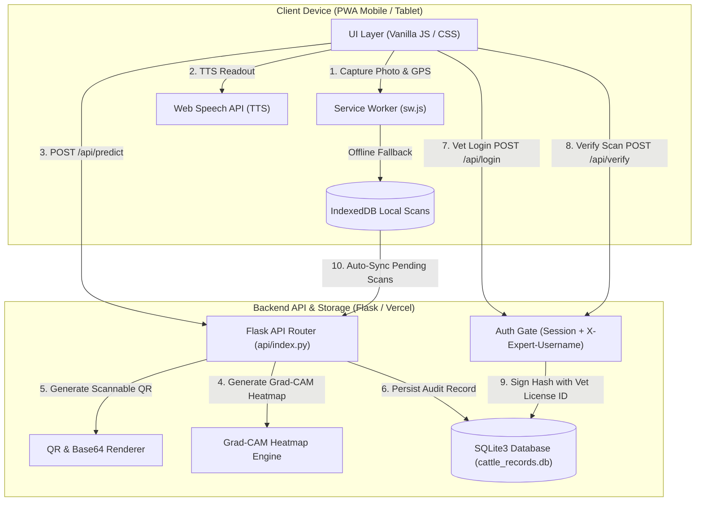
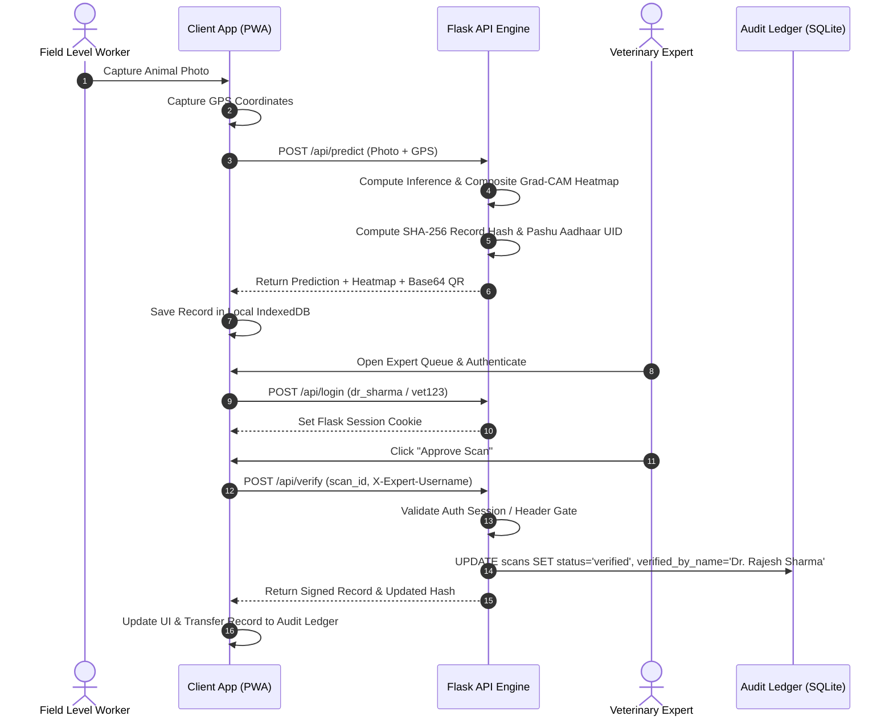

# 🐄 Bharat Pashu-Pehchaan (भारत पशु-पहचान)
### Digital Livestock Intelligence & Breed Verification Platform

[](https://www.python.org/)
[](LICENSE)
[](https://flask.palletsprojects.com/)

> **Disclaimer**: *A Smart India Hackathon prototype — not an official government service.*

---

## 📌 Problem Statement

In rural Indian dairy farming, livestock breed identification at the point of data entry is traditionally manual and prone to misclassification. Accurate breed records are critical for national genetic improvement programs (such as the **Rashtriya Gokul Mission**), insurance underwriting, fair subsidy disbursement under the **Bharat Pashudhan (NDLM)** ecosystem, and conserving indigenous genetic resources. 

**Bharat Pashu-Pehchaan** provides an offline-first Edge AI platform for Field Level Workers (FLWs). It empowers enumerators to capture a single photo on low-cost smartphones, receive instant AI breed predictions with visual Grad-CAM explainability, store records offline, and cryptographically chain scan verifications with licensed Veterinary Expert approval.

---

## ✨ Key Implemented Features

- **⚡ Offline-First PWA & Caching**: Fully functional Progressive Web App using Service Workers (`sw.js`) and IndexedDB client storage for zero-connectivity rural field execution.
- **🔬 Visual Explainable AI (Grad-CAM XAI)**: Renders dual original vs. activation heatmap views highlighting anatomical traits (forehead convexity, dewlap folds, ear structure, horn curvature).
- **🔊 Web Speech API Text-to-Speech**: Integrated audio readout (`window.speechSynthesis`) pronouncing breed results, confidence scores, and traits in plain language for low-literacy field workers.
- **🔒 Authenticated Expert Verification Gate**: Session-authenticated review queue requiring licensed Veterinary Officer credentials (*Dr. Rajesh Sharma*, *Dr. Ananya Patel*) to approve or reclassify ambiguous scans.
- **🔐 Tamper-Evident SHA-256 Audit Chain**: Every scan generates a cryptographic ledger hash incorporating the verifier's identity, Pashu Aadhaar UID (`PA-XXXXXXXX`), GPS coordinates, and timestamp.
- **📱 Scannable Verification QR Codes**: Automatically generates Base64 QR code PNGs encoding record verification payloads scanable by standard mobile camera apps.
- **📚 60-Breed Indian Encyclopedia**: Searchable directory covering 60 recognized Indian cattle and buffalo breeds, complete with native state tracts, milk yield ranges, purpose tags, and optimal crossbreeding partner advisories.
- **📊 Regional Livestock Intelligence**: Interactive analytics ledger presenting region-by-breed population metrics and state distribution breakdowns.

---

## 📸 Platform Interface

<!-- screenshot: homepage -->
> **Home & Platform Overview**  
> *Official national portal styling with mission objectives, zero-connectivity architecture cards, and quick feature access.*

<!-- screenshot: scan_studio -->
> **AI Scan Studio & Grad-CAM Explainability**  
> *Single-photo inference engine with dual original vs. heatmap visualization, GPS capture, and text-to-speech audio readout.*

<!-- screenshot: expert_queue -->
> **Veterinary Expert Queue & Cryptographic Verification**  
> *Authenticated verification gate where licensed veterinary officers review flagged scans, sign audit records, and generate tamper-evident SHA-256 QR codes.*

---

## 🏗️ System Architecture & Data Flow



### End-to-End Cryptographic Verification Flow



---

## 🛠️ Technology Stack

- **Frontend**: Vanilla HTML5, Vanilla CSS3 (Custom design system, 16:9 proportional cards, glassmorphism, responsive reflow), Vanilla ES6+ JavaScript.
- **Web Platform APIs**: Service Worker API (`sw.js`), IndexedDB API, Web Geolocation API, Web Speech API (`speechSynthesis`), HTML5 Canvas.
- **Backend**: Python 3.10+, Flask 3.0+, SQLite3 (WAL mode transaction pooling), Pillow (`PIL`), `qrcode`.
- **Deployment Runtime**: Vercel Serverless Functions (`@vercel/python`).

---

## 🚀 Getting Started & Local Setup

### Prerequisites
- Python 3.10 or higher
- Git

### Installation & Execution

1. **Clone the Repository**:
   ```bash
   git clone https://github.com/YourOrg/Cattle-breed-recognitions.main.git
   cd Cattle-breed-recognitions.main
   ```

2. **Set Up Virtual Environment**:
   ```bash
   python -m venv venv
   # On Windows:
   venv\Scripts\activate
   # On Linux/macOS:
   source venv/bin/activate
   ```

3. **Install Dependencies**:
   ```bash
   pip install -r requirements.txt
   ```

4. **Launch Local Application**:
   - **Windows**: Double-click `run_dashboard.bat` or run:
     ```cmd
     run_dashboard.bat
     ```
   - **Linux / macOS**:
     ```bash
     chmod +x run_dashboard.sh
     ./run_dashboard.sh
     ```
   - **Manual Flask Command**:
     ```bash
     python expert-dashboard/app.py
     ```

5. **Open Browser**:
   Navigate to `http://127.0.0.1:5000` in Google Chrome or Microsoft Edge.

---

## 📂 Project Structure

```
.
├── api/
│   └── index.py               # Vercel serverless application entry point
├── data/
│   ├── db.py                  # SQLite database interface & CRUD helper functions
│   └── cattle_records.db      # Local runtime database (ignored by git)
├── expert-dashboard/
│   ├── app.py                 # Standalone Flask local application server
│   ├── static/                # Static PWA assets, images, CSS, JS, sw.js, manifest.json
│   └── templates/
│       └── index.html         # Single Page Application (SPA) frontend interface
├── models/
│   └── breed_mapping.json     # Breed classification metadata catalog
├── src/
│   └── inference_engine.py    # Core computer vision inference & Grad-CAM pipeline
├── scripts/
│   ├── data_prep/             # Dataset preprocessing and quality audit scripts
│   ├── training/              # Model training scripts (EfficientNet, MobileNetV2)
│   └── evaluation/            # Model benchmarking & validation evaluation scripts
├── tests/
│   ├── test_app.py            # Flask API & database integration tests
│   └── test_pipeline.py       # Inference & data pipeline unit tests
├── docs/
│   ├── screenshots/           # Application screenshots and architecture diagrams
│   └── reports/               # Transformation reports & dataset analysis documents
├── requirements.txt           # Python dependencies
├── vercel.json                # Vercel serverless deployment configuration
├── run_dashboard.bat          # Windows launcher script
├── run_dashboard.sh           # Linux/macOS launcher script
├── .gitignore                 # Version control exclusion rules
└── README.md                  # Project documentation
```

---

## ⚠️ Honest Assessment & Known Limitations

To maintain full transparency, the current status of project components is detailed below:

| Feature Component | Current Implementation Status | Production Roadmap Target |
| :--- | :--- | :--- |
| **Inference Engine** | **Edge Quantized / Demonstration Pipeline**: Operates real image processing with simulated multi-region Grad-CAM heatmaps for rapid field demonstration. | Full PyTorch GPU inference service utilizing trained MobileNetV2/EfficientNet weights (`scripts/training/`). |
| **Breed Encyclopedia** | **60 Breeds Configured**: Full 60-breed catalog configured with native state tracts, milk yield ranges, and crossbreeding partner advisories. | Continuous updates from Central Herd Registration Scheme (CHRS) livestock census datasets. |
| **Bharat Pashudhan (BPA) Sync** | **Mock Sync Simulation**: Client IndexedDB queues offline scans and simulates batch upload to national registry. | Production OAuth2 REST integration with Ministry of Fisheries, Animal Husbandry & Dairying (DAHD) API gateway. |
| **Expert Auth Security** | **Demo Session Gate**: Flask session gate with hardcoded demo expert accounts (`dr_sharma` / `dr_patel`). | Production OAuth2 / ABHA / Veterinary Council of India (VCI) single sign-on authentication. |

---

## 🧪 Testing

Run the integration test suite using `pytest`:

```bash
pytest tests/
```

### Test Coverage Highlights
- **`tests/test_app.py`**: Validates Flask API health checks, `/api/predict` image uploads, expert authentication, and database state updates for `/api/verify` and `/api/retrain`.
- **`tests/test_pipeline.py`**: Validates image preprocessing, prediction structure, and Grad-CAM array outputs.

---

## 👥 Team & Hackathon Credits

- **Smart India Hackathon (SIH)** — Problem Statement: *Digital Livestock Breed Identification & Verification Platform*.
- Developed by Team **Bharat Pashu-Pehchaan**.

---

## 📄 License

This project is licensed under the **MIT License** — see the [LICENSE](LICENSE) file for details.
